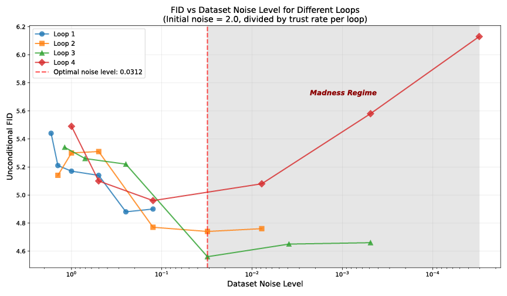

<!-- markdownlint-disable first-line-h1 -->
<!-- markdownlint-disable html -->
<!-- markdownlint-disable no-duplicate-header -->

# Ambient Dataloops

[](https://huggingface.co/spaces/adrianrm/ambient-dataloops-text2image)
[](https://huggingface.co/adrianrm/ambient-dataloops)
[](https://pytorch.org/)

This repository hosts the official PyTorch implementation of the paper: [Ambient Dataloops: Generative Models for Dataset Refinement](https://arxiv.org/abs/2601.15417)

Authored by: Adrián Rodríguez-Muñoz, William Daspit, Adam Klivans, Antonio Torralba, Constantinos Daskalakis, Giannis Daras


**Highlights ✨**:

- **Beyond just using low quality data:** Our method not only achieves strong performance without the need for data filtering or curation, but actively improves the lower quality parts of its dataset.
- **Avoids destructive self-consuming loops:** At each generation, we treat the synthetically improved samples as noisy, but at a slightly lower noisy level than the previous iteration, and we use Ambient Diffusion techniques for learning under corruption
- **Greatly improve diversity, without losing quality:** Empirically, Ambient Dataloops achieve state-of-the-art performance in unconditional and text-conditional image generation and de novo protein design.


## Results


Our model refines its training data at each iteration of our algorithm: the Dataloop. When data, not compute, is the bottleneck, our method increases the quality and diversity of trained models, solely from using cleverly our precious available data. We don't make any changes in the architecture, training/sampling hyperparameters or the optimization algorithm. Simply train, refine, and repeat.

👉 Try it out on [Hugging Face Spaces](https://huggingface.co/spaces/adrianrm/ambient-dataloops-text2image): an interactive demo of the Ambient-o text-to-image model.

### Text-to-image results

**Table 1: Quantitative benefits of Ambient Loops on COCO zero-shot generation and GenEval.**
| Method | FID-30K (↓) | Clip-FD-30K (↓) | Overall | Single | Two | Counting | Colors | Position | Color Attribution |
|--------|-------------|------------------|---------|--------|-----|----------|--------|----------|-------------------|
| Micro-diffusion | 12.37 | 10.07 | 0.44 | 0.97 | 0.33 | 0.35 | 0.82 | 0.06 | 0.14 |
| Ambient-o (L0) | 10.61 | 9.40 | 0.47 | 0.97 | **0.40** | **0.36** | 0.82 | 0.11 | 0.14 |
| Ambient Loops (L1) | **10.06** | **8.83** | **0.47** | **0.97** | 0.38 | 0.35 | 0.78 | **0.11** | **0.19** |

*The first two columns show COCO metrics (Fidelity & Alignment), while the remaining columns show GenEval Benchmark results. Bold values indicate best performance.*

### De-novo protein design results

**Table 2: Designability and diversity for protein structure generation.**
| Model | Designability (%↑) | Diversity (↑) |
|-------|-------------------|---------------|
| *Ambient Proteins* (L0, γ = 0.35) | **99.2** | 0.615 |
| **Ambient Loops** (L1, γ = 0.35) | 99.0 | **0.703** |
| Proteina (FS γ = 0.35) | 98.2 | 0.49 |
| Genie2 | 95.2 | 0.59 |
| FoldFlow (base) | 96.6 | 0.20 |
| FoldFlow (stoc.) | 97.0 | 0.25 |
| FoldFlow (OT) | 97.2 | 0.37 |
| FrameFlow | 88.6 | 0.53 |
| RFDiffusion | 94.4 | 0.46 |
| Proteus | 94.2 | 0.22 |

*↑ indicates higher is better. Bold values indicate best performance in each metric.*

### More results in the paper

Check out the paper for many more results.

## Text-to-image model

The pre-trained model is available on Hugging Face:
[adrianrm/ambient-dataloops](https://huggingface.co/adrianrm/ambient-dataloops).

To use it, you can run the following:

```python
import torch
from micro_diffusion.models.model import create_latent_diffusion
from huggingface_hub import hf_hub_download
from safetensors import safe_open

# Init model
params = {
    'latent_res': 64,
    'in_channels': 4,
    'pos_interp_scale': 2.0,
}
model = create_latent_diffusion(**params).to('cuda')

# Download weights from HF
model_dict_path = hf_hub_download(repo_id="adrianrm/ambient-dataloops", filename="model.safetensors")
model_dict = {}
with safe_open(model_dict_path, framework="pt", device="cpu") as f:
   for key in f.keys():
       model_dict[key] = f.get_tensor(key)

# Convert parameters to float32 + load
float_model_params = {
    k: v.to(torch.float32) for k, v in model_dict.items()
}
model.dit.load_state_dict(float_model_params)

# Eval mode
model = model.eval()

# Generate images
prompts = [
    "Pirate ship trapped in a cosmic maelstrom nebula, rendered in cosmic beach whirlpool engine, volumet",
    "A illustration from a graphic novel. A bustling city street under the shine of a full moon.",
    "A giant cobra snake made from corn",
    "A fierce garden gnome warrior, clad in armor crafted from leaves and bark, brandishes a tiny sword.",
    "A capybara made of lego sitting in a realistic, natural field",
    "a close-up of a fire spitting dragon, cinematic shot.",
    "Panda mad scientist mixing sparkling chemicals, artstation",
    "the sailor galaxia. beautiful, realistic painting by mucha and kuvshinov and bilibin. watercolor, thick lining, manga, soviet realism",
]
images = model.generate(prompt=prompts, num_inference_steps=30, guidance_scale=5.0, seed=42)
```

## Dataset-Model co-evolution

Our method is as follows. Firstly, we annotate each of our datapoints according to their quality, by assigning them a minimum diffusion time at which low and high quality data distributions approximately merge. Second, we train a diffusion model using Ambient Diffusion (Daras et al., 2025c, 2023) techniques, which can learn from data of heterogenous qualities. Thirdly, we *restore* the original dataset using a trained model, by performing posterior sampling on each datapoint starting from the minimum diffusion time we assigned at the beginning, resulting in a better, higher quality dataset. We call this process an Ambient Dataloop. Successive iterations of this process lead to a co-evolution of both the model and the dataset.

## Imperfect datasets, imperfect optimisation

The idea of dataset refinement, despite being natural, presents a paradox. First, it seems to be violating the data processing inequality; information cannot be created out of thin air, and hence any processing of the original data cannot have more information for the underlying distribution than the original dataset. While this is true, it is important to consider that the first training might be suboptimal due to failures of the optimization process. Hence, dataset refinement can be thought of as a reorganization of the original information in a way that facilitates learning and creates a better optimization landscape. Indeed, what our empirical results show is that training on imperfect datasets leads to imperfect optimisation, even with Ambient Diffusion training. Trying to remove the imperfections, even without external verifiers, results in better training, better optimisation, and better results.

Secondly, several recent works have shown that naive training on synthetic data leads to catastrophic self-confusing loops and mode collapse (Alemohammad et al., 2024a; Shumailov et al., 2024; Hataya et al., 2023; Martinez et al., 2023; Padmakumar & He, 2024; Seddik et al., 2024; Dohmatob et al., 2024). Our approach avoids this scenario by accounting for learning errors at each iteration using Ambient Diffusion to account for model errors, and by running only a small number of Ambient Dataloops.



*The horizontal axis is the noise level we denoise a corrupted CIFAR-10 dataset after $k$ loops, where $k$ changes for each one of the lines. Going too fast or too slow is suboptimal. There is a point after which reducing the dataset further only hurts (madness regime) because the current model has reached its denoising capacity. Decreasing the noise level at the right speed achieves maximum performance with $k > 1$ loops. FID is always computed with respect to the original clean CIFAR-10.*


## Citation

```bibtex
@article{rodriguez2025ambient,
  title = {Ambient Dataloops: Generative Models for Dataset Refinement},
  author = {Rodriguez-Munoz, A. and Daspit, W. and Klivans, A. and Torralba, A. and Daskalakis, C. and Daras, G.},
  year = {2025},
}
```


## Acknowledgements

We used [EDM codebase](https://github.com/NVlabs/edm) and [Ambient Omni](https://github.com/giannisdaras/ambient-omni/) for our pixel diffusion experiments. We used the [Microdiffusion](https://github.com/SonyResearch/micro_diffusion) and [Ambient Omni](https://github.com/giannisdaras/ambient-omni/) codebases for our text-to-image results. We used the [Genie2](https://github.com/aqlaboratory/genie2) [Ambient Proteins](https://github.com/jozhang97/ambient-proteins) codebases for our protein results.

We thank the authors for making their work publicly available.


## License
Our modifications of the existing codebases are under MIT License. Please always refer to the LICENSE of the repositories we used to demonstrate our method.


